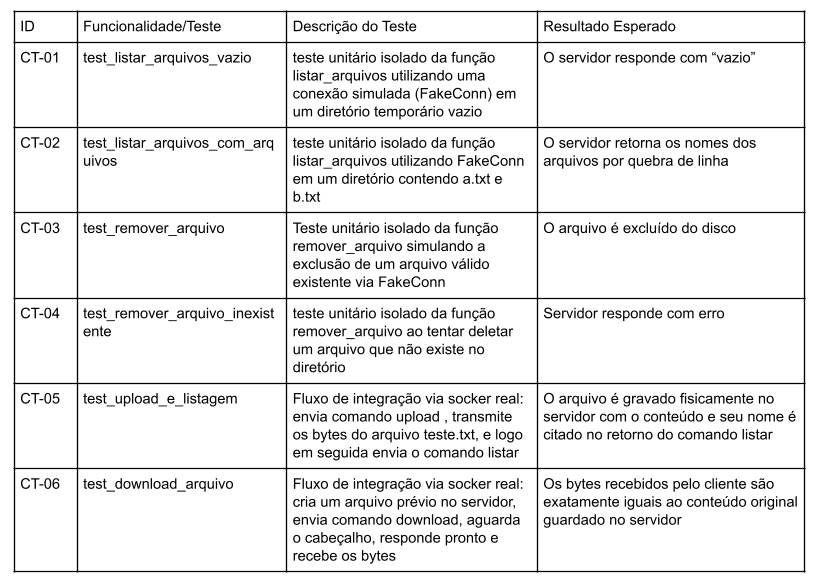
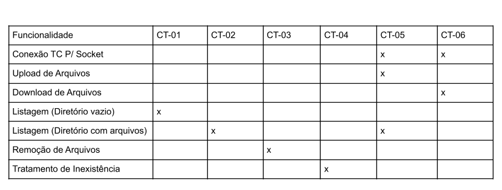

# Plano de Testes – Projeto Socket File Transfer

## 1. Objetivo

Este documento descreve o plano de testes do projeto de transferência de arquivos utilizando sockets TCP em Python. O objetivo é validar o funcionamento correto das funcionalidades implementadas no sistema cliente-servidor.
===

# 2. Ferramentas Utilizadas

| Ferramenta   | Finalidade                   |
| ------------ | ---------------------------- |
| Python 3.x   | Execução do sistema          |
| Git          | Controle de versão           |
| GitHub       | Hospedagem do repositório    |
| Terminal/CMD | Execução dos processos       |
| VS Code      | Desenvolvimento e testes     |
| Socket TCP   | Comunicação cliente-servidor |
| Pylint       | Analise estática             |
| Mypy         | Analise estática             |
| Bandit       | Analise estática             |
| pytest       | Teste unitário               |

---

# 3. Configurações do Ambiente

## Sistema Operacional

* Windows 10/11
* Compatível com Linux

## Requisitos

* Python 3 instalado
* Git instalado
* Conexão localhost habilitada
* Porta TCP 5050 livre

## Estrutura de Pastas

```text
projeto/
│
├── client_files/
├── server_files/
├── client.py
├── server.py
└── tests/
    │
    ├──test_sistema.py
    └──test_unitario.py
```
---

# 4. Restrições

* O sistema utiliza apenas comunicação local (`localhost`)
* Apenas arquivos simples são suportados como arquivos .txt
* Não há autenticação de usuários
* Não há criptografia de dados
* Ambos os códigos precisam ser executados em terminais diferentes ou utilizando "&"
* O servidor deve ser iniciado antes dos clientes

---

# 5. Procedimentos de Teste

## 5.1 Inicialização do Projeto

### Iniciar servidor

```bash
py server.py
```

### Iniciar cliente

```bash
py client.py
```
---

# 5.2 Procedimentos de Versionamento

## Commit

```bash
git add .
git commit -m "descrição da alteração"
```

## Push

```bash
git push
```

## Pull

```bash
git pull
```

## Pull Request

1. Criar branch de desenvolvimento
2. Realizar alterações
3. Enviar branch ao GitHub
4. Abrir Pull Request
5. Revisar e aprovar alterações
6. Realizar merge na branch principal
---

# 5.3 Procedimento de Teste Estático

# Analise estática 

 pylint server.py client.py

 mypy server.py client.py

 bandit server.py client.py

 # ou

python -m pytest -v tests/

python -m pylint server.py client.py

python -m mypy server.py client.py

python -m bandit server.py client.py

# 5.4 Procedimento de Teste Unitário e de Componente

python -m pytest -v tests/

# 5.5 Procedimento de Teste com o Ambiente Configurado

act -P ubuntu-latest=python:3.12-slim

---

# 6. Casos de Teste



---

# 7. Matriz de Funcionalidades x Testes


